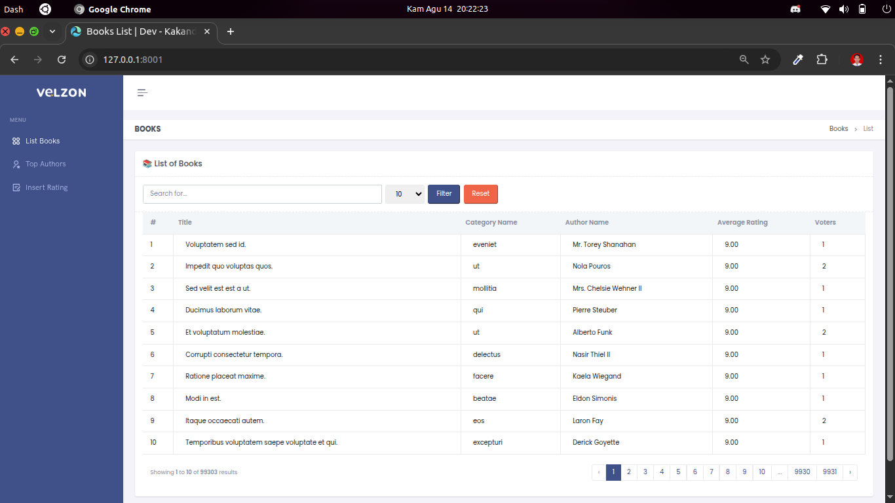
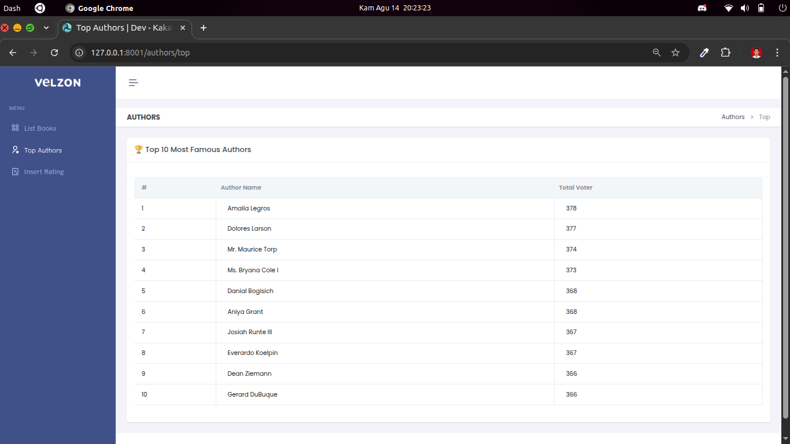

# Timedoor Backend Programming Exam – Moh. Bahrul 'Ulum

## Requirements

-   PHP >= 8.2
-   Laravel Version: 11.31
-   Database: MySQL

## Installation

1. Clone repository:

    ```bash
    git clone https://github.com/ulumdev/timedoor-backend-test-laravel.git
    cd timedoor-backend-test-laravel

    ```

2. Install dependencies:

    ```
    composer install
    ```

3. Copy .env.example to .env and set your database configuration.
   Edit this code in file .env

    ```
    DB_CONNECTION=mysql
    DB_HOST=127.0.0.1
    DB_PORT=3306
    DB_DATABASE=timedoor-backend-test-laravel-db {your database name}
    DB_USERNAME=phpmyadmin {your database username}
    DB_PASSWORD=pwd123 {your database password}
    ```

4. Run this in terminal one by one

    ```
    php artisan key:generate
    php artisan migrate --seed   |or|   php artisan migrate:fresh --seed
    php artisan serve
    ```

5. Access this URL or route:

    - http://localhost:8000 → List of Books
      

    - http://localhost:8000/authors/top → Top Authors
      

    - http://localhost:8000/rating/create → Input Rating
      
